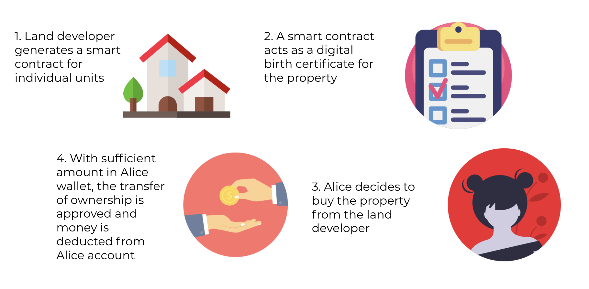

# Property Blockchain tranfer of ownership using Ethereum Smart Contract, Gananche, Truffle, Web3js, Solidity

This project aims to digitalise physical deeds/ownership of property using smart contracts. Transfering of property ownership can be done using blockchain because it is trusted system because of its immuatablity, traceability and security.

#### User Workflow Diagram
---


Land developer will first create x number of contracts based on the housing units built
When a buyer decides to buy the unit, the Land developer will transfer the contract ownership to the buyer. This means that the buyer has to first have a wallet that has stored ether, as our code checks if he has the available amount to actually buy the unit. If he does not, immediately when a buyer enters the transaction, it will check that he does not have enough ether and the transaction will fail. On the other hand, if he has enough ether, the transaction will proceed and he will obtain the ownership of the contract. This process happens when a current buyer wants to resell the house to another prospect buyer.

#### Application Workflow Diagram
---


#### Included Components
---
-  Solidity (Ethereum)
-  Metamask (Ethereum wallet)
-  Ganache
-  Truffle
-  Web3JS
-  ReactJS

#### Deployment Steps:
---
**Setting up Ethereum Smart Contract:**

```
git clone https://github.com/Phangster/blockchain_realestate
cd realestate/
```
Go to your project folder in terminal then execute :

Ensure your Ganache is opened in your desktop
```
rm -rf build/
truffle compile 
truffle migrate 
```
**Setting up UI:**

Go to your project folder in terminal then execute :

```
cd client
npm install
npm run start
```

**Run Test Cases:**

Go to your project folder in terminal then execute :

```
truffle test
```

---
##### Video Links:

Demo: https://www.youtube.com/watch?v=kOTFJkrmk_0&t=82s